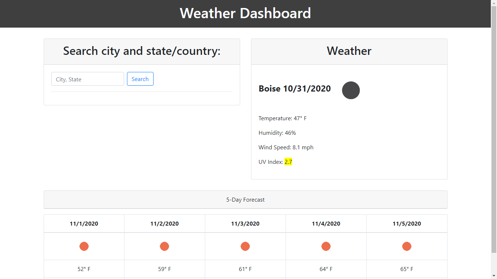
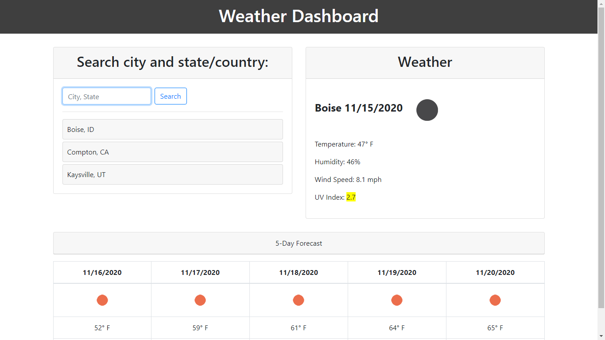
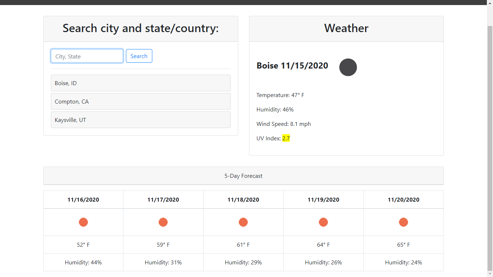

# weather-dashboard
https://jeffreytwoods2.github.io/weather-dashboard/

## Overview:
A weather app that displays a city's current weather, its 5-day forecast,
and your search history for the session.

## HTML:
Most content inside Bootstrap cards to keep things aligned and responsive

I had trouble keeping the 5-day forecast aligned, so I turned it into a Bootstrap
table, which is highly responsive and scrolls easily on smaller viewports

## CSS:
Very light CSS work, only changing limited background colors and other small adjustments

## JS:
Location data was obtained through the MapQuest API

Weather data through the OpenWeather API

I used one function to look up a city's coordinates and then obtain the weather from those coords.
This was done because various buttons/elements needed to be able to populate weather data on the page, and I didn't want to repeat myself at all. Function is defined once and used extensively throughout.

## Screencaps:

